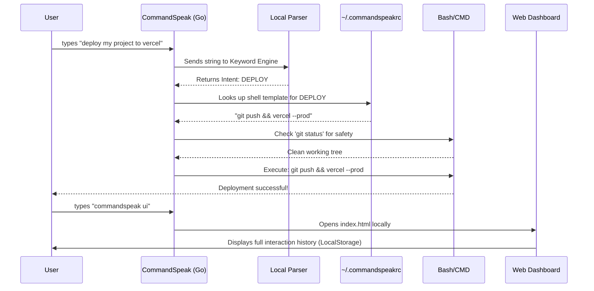

<div align="center">
  <h1>🚀 CommandSpeak</h1>
  <p><b>Terminal Velocity — Natural Language CLI Tools for Developer Workflows</b></p>
  <p><i>A Track 4 Submission for CYHI Hackathon (Team: eteranel byte)</i></p>
</div>

---

**CommandSpeak** is a powerful CLI tool that saves developers time by translating simple English sentences into complex terminal commands. 

No more googling obscure git flags or memorizing exact bash scripts. Just speak plain English, and CommandSpeak executes the right developer commands. Best of all, it works **100% offline** with no external LLM API keys required.

## ✨ Features

- 🧠 **Natural Language Parsing:** Say `"push code to vercel"`, `"deploy my project"`, or `"clean my old branches"`. The built-in keyword scoring engine instantly figures out your intent.
- 📦 **Interactive Repo Manager:** Run `commandspeak repo` to launch a fully interactive TUI (Terminal User Interface). Browse files, edit in Nano/Notepad, commit, push, pull, and branch—without leaving the menu.
- 🖥️ **Offline Web Dashboard:** Run `commandspeak ui` to pop open a sleek web UI showing your command history and settings. Data is stored safely in your browser's local storage.
- 🛡️ **Git Safety Confirmations:** Before pushing or deploying, it checks your `git status`. If you have uncommitted changes, it warns you before making a mess.
- 🔍 **Dry-Run Mode:** Add `--dry-run` or say `"show me how to deploy"` to see exactly what bash command would run without actually executing it.

---

## 🗺️ How It Works (The Complete Flow)

Here is the exact lifecycle of how a single English sentence becomes a safely executed terminal command:



---

## 🚀 Installation & Setup

You can run CommandSpeak in two ways: either download the pre-packaged ZIP (easiest) or build it from source using Go.

### Method 1: The Easiest Way (Download ZIP)
1. Download the `CommandSpeak-Windows.zip` file directly from this repository.
2. Extract the ZIP file into any folder on your computer.
3. Open a terminal (PowerShell or Command Prompt) in that folder.
4. Run commands directly! (e.g., `.\commandspeak "deploy my project"`)
5. *(Optional)* Add the extracted folder to your system's `PATH` variable so you can run `commandspeak` from anywhere.

### Method 2: Build from Source (Go Extension)
Ensure you have [Go](https://go.dev/) installed on your machine.

```bash
# 1. Clone the repository
git clone https://github.com/devchavda2007-web/commandspeak.git
cd commandspeak

# 2. Download Go dependencies
go mod tidy

# 3. Build and install the CLI globally
go install
```

> **Note:** Ensure your `~/go/bin` directory (or `%USERPROFILE%\go\bin` on Windows) is in your system's `PATH`.

---

## 📖 Usage Guide

### 1. The Natural Language CLI (All Supported Prompts)
Just type `commandspeak` followed by what you want to do. Here are all the natural language commands (intents) currently supported by the offline parser:

| What you want to do | Example Prompt you can type | Default Command it runs |
|---------------------|-----------------------------|-------------------------|
| **Deploy Project** | `commandspeak "deploy my project to vercel"` | `git add . && git commit -m "update" && git push && vercel --prod` |
| **Push Code** | `commandspeak "push my code with message fixed bug"` | `git add . && git commit -m "fixed bug" && git push` |
| **Check Status** | `commandspeak "show me my git status"` | `git status` |
| **Clone Repo** | `commandspeak "clone repo https://github.com/..."` | `git clone https://github.com/...` |
| **Install Packages**| `commandspeak "install dependencies please"` | `npm install` |
| **Start Server** | `commandspeak "start dev server"` | `npm start` |
| **Run Tests** | `commandspeak "run my tests and build"` | `npm test && npm run build` |
| **Undo Commit** | `commandspeak "undo my last commit"` | `git reset --soft HEAD~1` |
| **Clean Branches** | `commandspeak "clean my old branches"` | `git fetch -p && git branch -vv ...` |
| **Initialize Git** | `commandspeak "initialize git repository"` | `git init` |

> **Pro Tip:** You don't have to type these exactly! The tool uses keyword scoring, so saying `"push it"` or `"send code"` will both trigger the PUSH intent.

### 2. The Interactive Repo Manager
Want to manage a GitHub repo interactively?

```bash
$ commandspeak repo https://github.com/devchavda2007-web/commandspeak
```
*This opens a 10-option interactive menu to view files, edit natively, commit, push, and more.*

### 3. The Web Dashboard (`commandspeak ui`)
Want to see your command history or configure your settings in a beautiful GUI?

```bash
$ commandspeak ui
```
*This instantly opens the local dashboard in your web browser. No server or PHP required!*

### 4. Customizing Commands
Want to change what command runs when you say "deploy"?

```bash
$ commandspeak change
```
*This opens an interactive wizard to edit your `~/.commandspeakrc.json` file.*

---

## 🔒 Privacy & Architecture

CommandSpeak is designed for **maximum privacy and zero friction**:
1. **Offline NLP**: The natural language parser uses local keyword-scoring heuristics in Go. No code or prompts are sent to OpenAI/Anthropic.
2. **Serverless UI**: The `commandspeak ui` dashboard is a pure static web app that stores your command history directly in your browser's `localStorage`. Zero setup, zero PHP, zero external dependencies required.
3. **No Cloud Syncing**: Your history, configs, and repos never leave your computer. 

## 🏆 CYHI Hackathon Compliance
- **Track 4 (Terminal Velocity)**: Designed specifically to accelerate CLI workflows.
- All development was logged using the `cyhi log` tool.
- Implemented core deliverables: The Go CLI, interactive GitHub manager, NLP parser, and a beautifully visualized local web dashboard.
